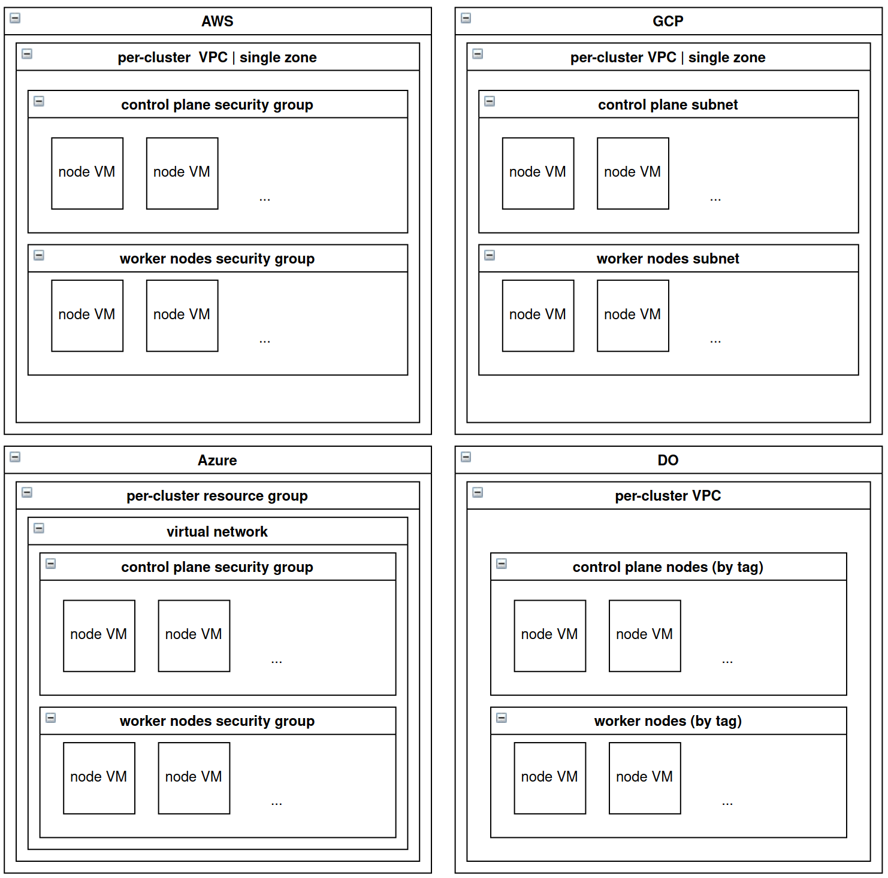

# Your cluster: architecture overview

This chapter summarizes the overall design of your Kubernetes cluster and how it's relationships with CAST AI platform.

## Cluster lifecycle
### Provisioning

You initiate creation of the cluster by providing CAST AI with:

* Access to your Cloud accounts - CAST AI uses these to call cloud APIs to build your infrastructure for you;
* Initial configuration of your cluster, like region or size of the control plane. We aim to keep these options to a minimum and use our own opinionated setup where appropriate.

### Reconciliation & healing

All clusters created on CAST AI enter a reconciliation loop, where platform periodically re-checks that actual infrastructure on your cloud reflects the specified configuration, and performs upgrades & patching. Reconciliation performs checks such as:
* Is cluster network configuration up to date;
* Are any nodes missing, e.g. accidentally deleted; 
* Are there any dangling resources on your cloud associated with your cluster to clean up.

## Resizing cluster 

You'll notice that CAST AI clusters don't have a "node pool" concept you might be familiar with. Instead, you can choose specific node configuration to be added whenever you need to expand the cluster, or select specific nodes to delete when shrinking it.

Same applies to autoscaling engine - it performs decisions per-node level, instead of choosing to grow or shrink a node pool.

### Cleanup

When you instruct CAST to delete your cluster, in general case platform will just try to collapse created cloud resources in the fastest way. Keep in mind that nodes will not be drained before deleting them, and any running workloads won't be given a chance to terminate gracefully. 

Deletion aims to minimize unintended removals. For example, virtual machines on AWS are deleted by a specific tag containing cluster UUID. If any additional VMs remain present in cluster's security group, that security group won't be deleted and you'll see delete operation fail.

## Cluster architecture

### Context

Below diagram highlights primary groups of components that define a relationship between CAST AI platform and your cluster.

New CAST AI users will start by interacting with the platform via console UI (<https://console.cast.ai>). Once the created cluster is ready, by downloading cluster's kubeconfig you are able to access your cluster directly. Some of the middleware that is running on the cluster (Grafana, Kubernetes dashboard) is directly reachable from UI through the single-signon gateway.

You can notice that there's a bi-direction link between your cluster and CAST AI platform. Not only the platform connects to your cloud infrastructure or the cluster itself; CAST AI also relies on the cluster to "call back" and inform about certain events:
* Cluster control plane nodes actions with provisioning engine, e.g. when to join the cluster;
* Nodes inform about operations being completed, like finishing joining the cluster;
* Relevant cloud events get propagated to provisioning engine & autoscaler, for example, "spot instance is being terminated by cloud provider";

Your app users don't interact with CAST AI in any way. You own your kubernetes cluster infrastructure 100%, including any ingress infrastructure to reach your cluster workloads.

## Cluster infrastructure

### Nodes

Here's the overview on where cluster virtual machines will be provisioned on your cloud.

### Ingress

TODO

### Network details

#### Region & zone

As you select a Cast region, for each cloud it maps to a specific region on that cloud. 

For example, **US East (Ashburn)** region maps to:
* AWS: us-east-1
* GCP: us-east4
* Azure: eastus
* Digital Ocean: nyc1

Currently, on each cloud CAST AI builds a single-zone setup of your cluster. Zone selection is cloud-specific.

#### Master nodes inbound

| Protocol | Port | Source | Description |
|---|---|---|---|
| tcp | 6443 | 0.0.0.0/0 | k8s API server |  
| udp | 51820 | 0.0.0.0/0 | WireGuard (if used)|

#### Worker nodes inbound

| Protocol | Port | Source | Description |
|---|---|---|---|
| udp | 51820 | 0.0.0.0/0 | WireGuard (if used) |
| tcp/udp | NodePort | 0.0.0.0/0 | k8s Service with type=LoadBalancer |

#### Subnets

| Range | Description |
|---|---|
| 10.96.0.0/12 | k8s services |
| 10.217.0.0/16 | k8s pods |
| 10.4.0.0/16 | WireGuard|
| 10.0.0.0/16 | GCP VPC. Smaller /24 blocks are allocated for subnets. |
| 10.10.0.0/16 | AWS VPC. Smaller /24 blocks are allocated for subnets. |
| 10.20.0.0/16 | AZURE VPC. Smaller /24 blocks are allocated for subnets. |
| 10.100-255.0.0/20 | DigitalOcean VPC. There is only one subnet which is allocated dynamically. |

