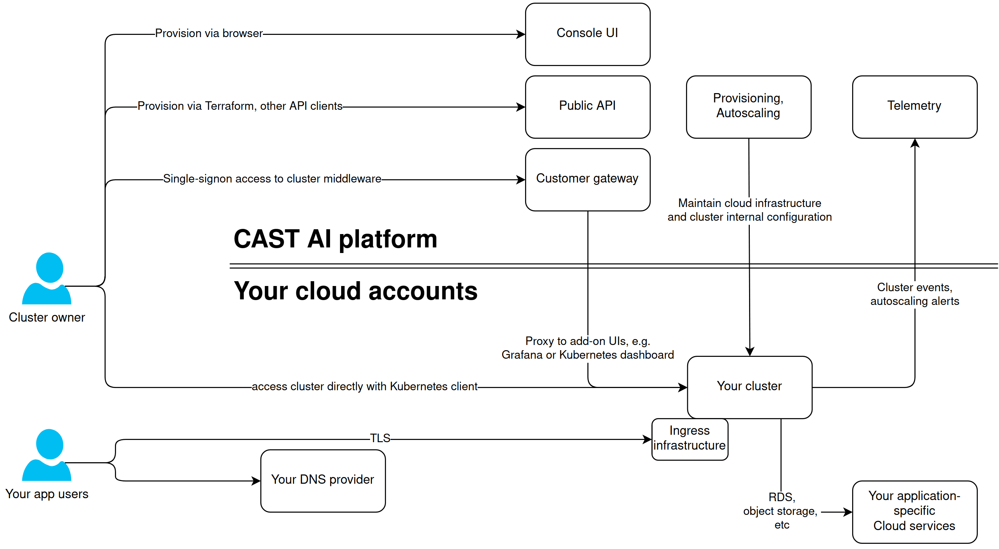

# Your cluster: architecture overview

!!! Note

    * Overview
    * Cloud credentials
    * Reconcile mechanism
    * Architecture diagram
    * Networking details
    * Cloud-specific notes
    * Addons
    * Telemetry

This chapter summarizes the overall design of your Kubernetes cluster and how it's relationships with CAST AI platform.

## Cluster lifecycle
### Provisioning

You initiate creation of the cluster by providing CAST AI with:

* Access to your Cloud accounts - CAST AI uses these to call cloud APIs to build your infrastructure for you;
* Initial configuration of your cluster, like region or size of the control plane. We aim to keep these options to a minimum and use our own opinionated setup where appropriate.

### Reconciliation & healing

All clusters created on CAST AI enter a reconciliation loop, where platform periodically re-checks that actual infrastructure on your cloud reflects the specified configuration, and performs upgrades & patching. Reconciliation performs checks such as:
* Is cluster network configuration up to date;
* Are any nodes missing, e.g. accidentally deleted; 
* Are there any dangling resources on your cloud associated with your cluster to clean up.

### Cleanup

When you instruct CAST to delete your cluster, in general case platform will just try to collapse created cloud resources in the fastest way. Keep in mind that nodes will not be drained before deleting them, and any running workloads won't be given a chance to terminate gracefully. 

Deletion aims to minimize unintended removals. For example, virtual machines on AWS are deleted by a specific tag containing cluster UUID. If any additional VMs remain present in cluster's security group, that security group won't be deleted and you'll see delete operation fail.

## Cluster architecture

### Context

Below diagram highlights primary groups of components that define a relationship between CAST AI platform and your cluster.

New CAST AI users will start by interacting with the platform via console UI (<https://console.cast.ai>). Once the created cluster is ready, by downloading cluster's kubeconfig you are able to access your cluster directly. Some of the middleware that is running on the cluster (Grafana, Kubernetes dashboard) is directly reachable from UI through the single-signon gateway.

You can notice that there's a bi-direction link between your cluster and CAST AI platform. Not only the platform connects to your cloud infrastructure or the cluster itself; CAST AI also relies on the cluster to "call back" and inform about certain events:
* Cluster control plane nodes actions with provisioning engine, e.g. when to join the cluster;
* Nodes inform about operations being completed, like finishing joining the cluster;
* Relevant cloud events get propagated to provisioning engine & autoscaler, for example, "spot instance is being terminated by cloud provider";

Your app users don't interact with CAST AI in any way. You own your kubernetes cluster infrastructure 100%, including any ingress infrastructure to reach your cluster workloads.

## Cluster infrastructure

<TODO: diagram: zones, ingress, networks>

# Autoscaling 

You'll notice that CAST AI clusters don't have a "node pool" concept you might be familiar with. Instead

zones

open ports

traffic

## Cloud specific notes

### AWS

TODO: node roles

### GCP

TODO: describe no node permissions