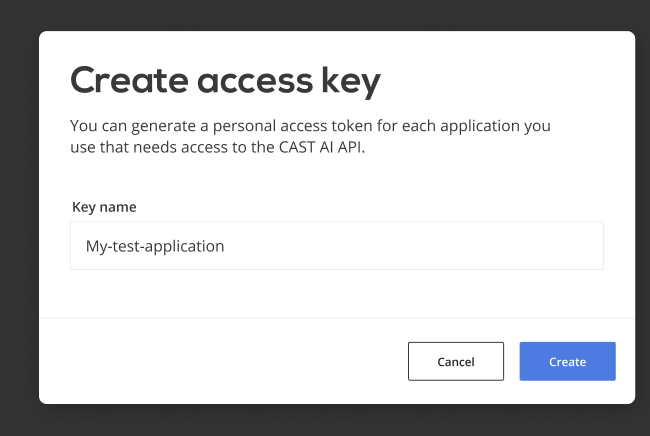

# Accessing CAST AI services via API

## Overview

We build our services at CAST AI API-first; anything you can do in our console UI is available via REST API. You can
use either your prefered way to call REST services directly, or leverage our Terraform plugin automate your
infrastructure provisioning.

## Authentication

Before you can use our API, either with your preferred REST client, or via Terraform, you'll need an API key.

### Obtaining API access key

From the top menu, open [API | API access keys](https://console.cast.ai/user/api-access-keys) and select **create access key** and name your key:



We advise to use descriptive name for your intended purpose - it will be easier to distinguish which key is used for which
integration if you add more keys later.

When the key is created - save it because **you will not be able to view the key again
after this window is closed**.


The reason API key value is visible only at a time of creation is because we do not store the key in plain text on our
system. For security reasons, CAST AI "forgets" key value after giving it to you, and later is only able to verify
if key is valid, but not to re-retrieve the value for you.
  
If you lose your key, the only solution is to create a new key.

### CAST AI Swagger setup

You can test your key directly in our [API specification](../api/api.md#api-specification). 

Visit <https://api.cast.ai/v1/spec/>, click
"Authorize" and enter your key for `X-API-Key` field.

After setting this up, you are now ready to use *"Try it out"* button that is available for each endpoint.

### Using keys in API calls

To authenticate, provide the key in  `X-API-Key` HTTP header. For example, for `curl` this would be:

```
curl -X GET "https://api.cast.ai/v1/kubernetes/clusters" -H "X-API-Key: your-api-key-here" | jq
```

## API specification

Our API contract is published as OpenAPI v3 specification. You can check it on our
Swagger UI:

<https://api.cast.ai>

This will bring your to our current specification. Here you will be able to familiarize yourself with available APIs
and try functionality directly in the browser.

!!! note
    To try out APIs in the browser you will need an API access key.
    See [Authentication](../api/api.md#authentication).

We do not maintain any public SDKs but you can generate an API client for your programming
 language using many of the [OpenAPI generators](https://openapi.tools/#sdk). Use below json as a spec:

<https://api.cast.ai/v1/spec/openapi.json>

!!! note
    OpenAPI is widely supported. Many tools (e.g. Postman) allow to import OpenAPI definitions as well. See
    documentation for your REST tooling to find out more.
    
 ## Terraform provider

Your CAST.AI infrastructure can be automated via [Terraform](https://www.terraform.io/) using _terraform-provider-castai_ provider.

Installation steps, example projects and releases are available at the repository: <https://github.com/castai/terraform-provider-castai>.

