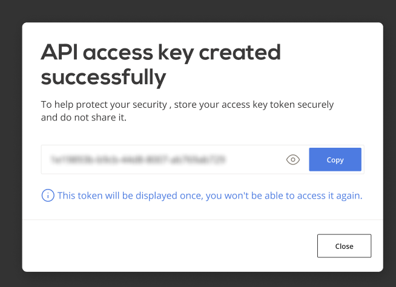

# Authentication

Before you can use our API, either with your preferred REST client or via Terraform, you will need an API key.

## Obtaining API access key

From the top menu in the CAST AI console, open [API | API access keys](https://console.cast.ai/user/api-access-keys), select **create access key** and name your key:


We advise using the descriptive name for your intended purpose - it will be easier to distinguish which key is used for which
integration if you add more keys later.

!!! important
    When the key is created - save it because **you will not be able to view the key again after this window is closed**.



The reason API key value is visible only at the time of creation is that we do not store the key in plain text on our
system. For security reasons, CAST AI "forgets" key value after giving it to you, and later is only able to verify
if the key is valid, but not to re-retrieve the value for you.

If you lose your key, the only solution is to create a new key.

### CAST AI Swagger setup

You can test your key directly in our [API specification](../api/specification.md).

Visit <https://api.cast.ai/v1/spec/>, click
"Authorize" and enter your key for `X-API-Key` field.

After setting this up, you are now ready to use the *"Try it out"* button that is available for each endpoint.

### Using keys in API calls

To authenticate, provide the key in  `X-API-Key` HTTP header. For example, for `curl` this would be:

```
curl -X GET "https://api.cast.ai/v1/kubernetes/clusters" -H "X-API-Key: your-api-key-here" | jq
