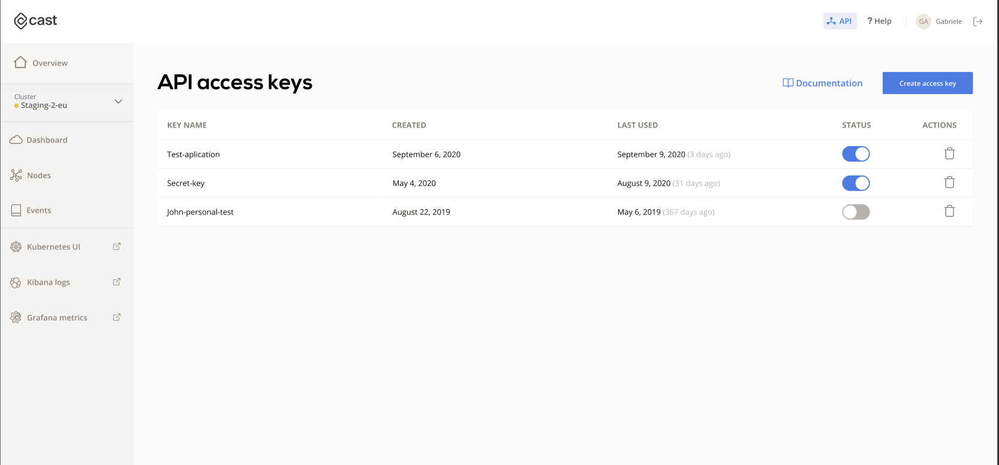

# Authentication

Before you can use our API, either with your preferred REST client, or via Terraform, you'll need an API key.

## Obtaining API access key

From the top menu, open [API | API access keys](https://console.cast.ai/#todo-api-access-keys).



Clicking on "create access key" opens a dialog where all you need is to name your key. Use descriptive name for your
intended purpose - later, when you have more keys, it will be easier to distinguish which key is used for which
integration.


After key is created, you are presented with a key itself. Save that key, as you won't be able to retrieve it again
after this window is closed.


The reason API key value is visible at create time only is because we don't store the key in plain text on our
system. For security reasons, Cast.AI "forgets" key value after giving it to you, and later is only able to verify
if key is valid, but not to re-retrieve the value for you.
  
If you lose your key, the only solution is to create a new key.

## Setting up Cast.AI Swagger

You can test your key directly in our [API specification](specification.md). Visit https://api.cast.ai/v1/spec/, click
 "Authorize
" and
 enter your key for `X-API-Key` field.
 
After setting this up, you are now ready to use "Try it out" button that is available for each endpoint.

## Using keys in API calls

To authenticate, provide the key in  `X-API-Key` HTTP header. For example, for `curl` this would be:

```
curl -X GET "https://api.cast.ai/v1/kubernetes/clusters" -H "X-API-Key: your-api-key-here" | jq
```

