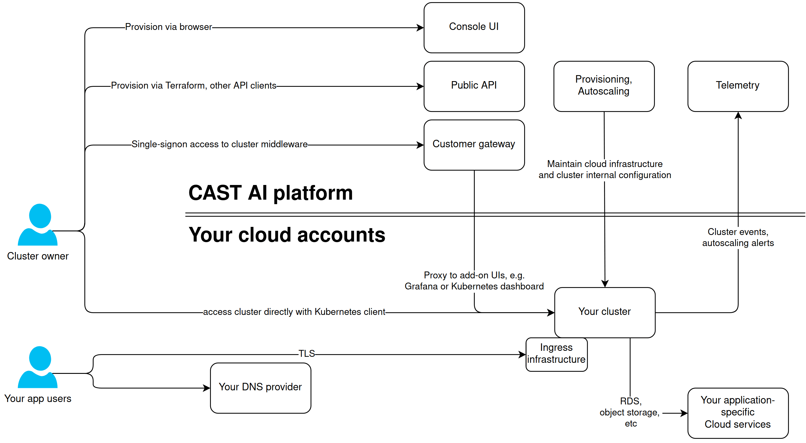

## Cluster architecture

### Context

When you [create a cluster](../getting-started.md#create-cluster) you can [download kubeconfig](../getting-started.md#deploy-application) to access your cluster directly. Some of the middleware that is running on the cluster (Grafana, Kubernetes dashboard) is directly reachable from [console UI](../console-overview/console-overview.md) through the single sign-on gateway.

You can notice on the diagram below that there is a bi-direction link between your cluster and CAST AI platform. Not only the platform connects to your cloud infrastructure or the cluster itself; CAST AI also relies on the cluster to "call back" and inform about certain events:

* Cluster control plane nodes actions with provisioning engine, e.g. when to join the cluster;
* Nodes inform about operations being completed, like finishing joining the cluster;
* Relevant cloud events get propagated to provisioning engine & autoscaler, for example, "spot instance is being terminated by cloud provider";

Your app users do not interact with CAST AI in any way. You own your kubernetes cluster infrastructure 100%, including any [ingress infrastructure](../concepts/cluster-infrastructure.md#ingress) to reach your cluster workloads.

Below diagram highlights primary groups of components that define a relationship between CAST AI platform and your cluster:

