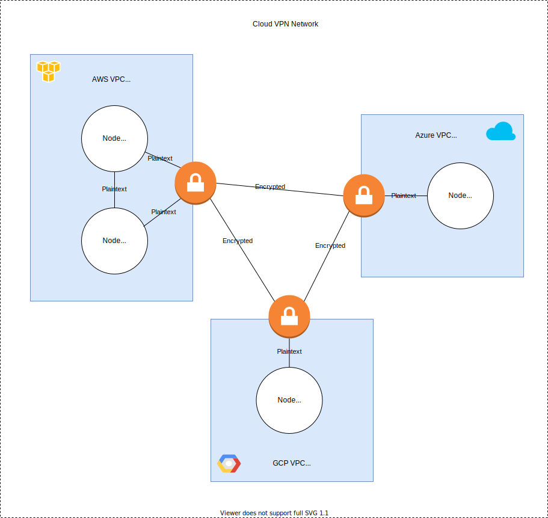

# Cluster VPN overview

This chapter summarizes Virtual Private Network (VPN) architecture for multi-cloud private network.

## Available options

Currently CAST AI platform supports two VPN options:

1. Cloud provided VPN.
2. WireGuard.

Let's look at each option in more details.

### Cloud provided VPN

The following example shows Kubernetes cluster with nodes on AWS, AZURE and GCP clouds.
In order to access each nodes Virtual Private Cloud (VPC) network CAST AI platform
provisions managed Highly Available (HA) VPN gateways.

#### Cloud provided VPN Network details

- VPN Gateway is created on each cloud and adds additional cluster costs.
- Traffic between nodes in different VPC is always encrypted.
- Traffic between nodes in the same VPC is plaintext.

!!! note
    Cloud provided VPN is currently not available on Digital Ocean.

### WireGuard

The following example shows Kubernetes cluster with nodes on AWS, AZURE, GCP and DIGITAL OCEAN clouds.
Each node runs WireGuard kernel module and VPN peers configuration, keys exchange, network interfaces
and routing tables are fully managed by CAST AI platform.

#### WireGuard Network details

- Each nodes has public IP for node to node communication.
- Firewall rules allows to send/receive UDP packets on 51820 port for each node.
- Each node assigned private IP from clouds VPC subnet range and WireGuard interface IP
from 10.4.0.0/16 subnet.
- Traffic between nodes in different VPC is always encrypted.
- Traffic between nodes in the same VPC is encrypted or plaintext depending on topology selection.

When creating cluster you can choose from one of the currently available topologies:

| Topology | Description |
|---|---|
| Full Mesh | Traffic is encrypted between each node even if it’s located in the same VPC. |
| Cross Location Mesh | Traffic is encrypted only between nodes in different VPC. |
