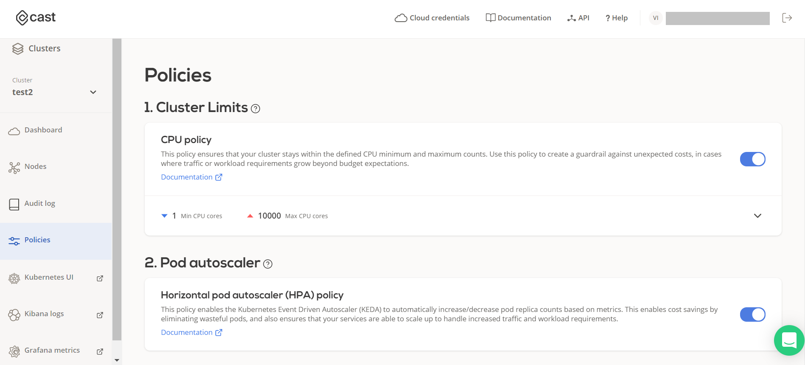

# Policies

  Manage policies for the selected cluster. Policies will help you optimize and reduce cost of your cloud bill and will automate the process of scaling up and down for you.

  1. **Cluster limits** - policies that limit the cluster scale to the defined limits. This policy has the highest priority, and all the other policies cannot scale the cluster over the defined limits.
     - **CPU policy** - This policy ensures that your cluster stays within the defined CPU minimum and maximum counts. Use this policy to create a guardrail against unexpected costs, in cases where traffic or workload requirements grow beyond budget expectations.

  2. **Pod autoscaler** - policies that scale the cluster pods based on demand (e.g. CPU or memory utilization). This policy is second in priority, after the limits policy.
     - **Horizontal pod autoscaler (HPA) policy** - This policy enables the Kubernetes Event Driven Autoscaler (KEDA) to automatically increase/decrease pod replica counts based on metrics. This enables cost savings by eliminating wasteful pods, and also ensures that your services are able to scale up to handle increased traffic and workload requirements.

  3. **Node autoscaler** - policies to scale cluster based on the CPU or memory demand
     - **Spot/Preemtive Instances policy** - This policy enables the CAST optimization engine to purchase Spot (AWS / Azure) or Preemptive (GCP) instances when pods are labeled by the user. CAST automatically handles instance interruptions and replaces instances when they are terminated by the CSP. Spot instances typically yield savings of 60-80% and are useful for stateless workloads such as microservices. CAST AI currently supports AWS Spot instances, with GCP and Azure rolling out shortly.
     - **Unscheduled pods policy** - This policy automatically adds nodes to your cluster so that your pods have a place to run. Both CPU and Memory requirements are considered. You can use CAST specified labels to ensure that your pods run in a specific Cloud, or let the CAST AI optimization engine choose for you.
     - **Node Deletion Policy** - This policy will automatically remove nodes from your cluster when they no longer have scheduled workloads. This allows your cluster to maintain a minimal footprint and reduce cloud costs.

     For more information see:

     - [Autoscaling policies](../guides/autoscaling-policies.md)
     - [Horizontal Pod autoscaler](../guides/hpa.md)
     - [Spot/Preemptible Instances](../guides/spot.md)

