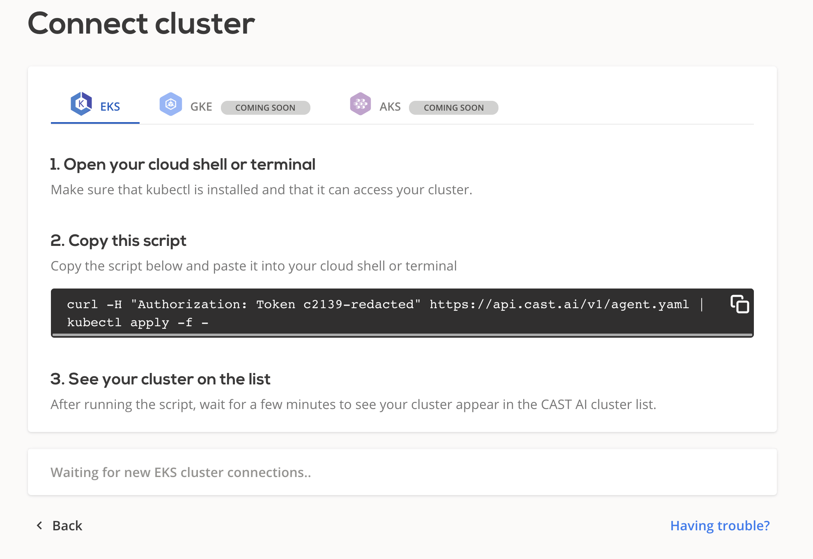

# External Cluster Agent

* GitHub repository: <https://github.com/castai/k8s-agent>



## Troubleshooting

---


### Your cluster does not appear in the Console Dashboard

1. Check the Pod logs:
    ```sh
    kubectl logs -n castai-agent -l app.kubernetes.io/name=castai-agent
    ```
   
2. You might get output similar to this:
   ```text
   time="2021-05-06T14:24:03Z" level=info msg="starting the agent"
   time="2021-05-06T14:24:03Z" level=info msg="using cluster provider discovery"
   time="2021-05-06T14:24:03Z" level=fatal msg="agent failed: registering cluster: getting cluster name: describing instance_id=i-026b5fadab5b69d67: UnauthorizedOperation: You are not authorized to perform this operation.\n\tstatus code: 403, request id: 2165c357-b4a6-4f30-9266-a51f4aaa7ce7"
   ```
   2.1. This particular example indicates that we failed to collect the relevant data required to identify your cluster on our system.

3. To solve this issue, create a deployment file such as this:
   ```yaml
   apiVersion: apps/v1
   kind: Deployment
   metadata:
     name: castai-agent
     namespace: castai-agent
     labels:
       "app.kubernetes.io/name": castai-agent
   spec:
     replicas: 1
     selector:
       matchLabels:
         "app.kubernetes.io/name": castai-agent
     template:
       metadata:
         labels:
           "app.kubernetes.io/name": castai-agent
       spec:
         serviceAccountName: castai-agent
         containers:
           - name: agent
             image: castai/agent:latest
             env:
               - name: API_URL
                 value: api.cast.ai
               - name: EKS_ACCOUNT_ID
                 value: {YOUR-AWS-ACCOUNT-ID} # FILL THIS
               - name: EKS_REGION
                 value: {YOUR-EKS-CLUSTER-REGION} # FILL THIS
               - name: EKS_CLUSTER_NAME
                 value: {YOUR-CLUSTER-NAME} # FILL THIS
             envFrom:
               - secretRef:
                   name: castai-agent
             resources:
               requests:
                 cpu: 100m
                 memory: 64Mi
               limits:
                 cpu: 1000m
                 memory: 256Mi
   ```
   3.1. Add the values for the missing parts next to the `#FILL THIS` comment.
   
   3.2. Apply the deployment file using `kubectl apply -f deployment.yaml`.
   
   
!!! tip

      If you are sitll encountering any issues, ping us with logs output at:

      <https://castai-community.slack.com/>
