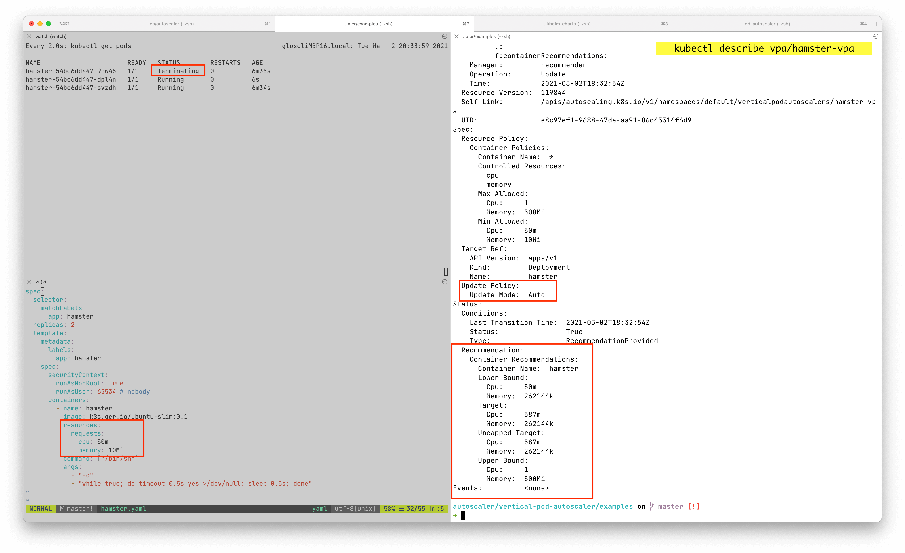

# Right Sizing recommendations with VPA

## Recommendations example



<-- On the left side you can see:

- The initial values that were set before Virtual Pod Autoscaler (VPA) took action.
- One of the pods is being terminated, due to auto mode changing the CPU/MEM values right away (causing potential downtime).

--> On the right side you can see:

- VPA recommendation couple minutes right after.

## VPA install guide

### Pre-requisites

1. In order for the instructions to work on **macOS** one needs to have latest version of OpenSSL from Homebrew:

    a) `brew install openssl` (make use of that OpenSSL version, rather than macOS native one).

    b) `brew info openssl` to see the instructions for setting this openssl version as your default one.

2. Metrics-server up and running

   ```
   kubectl apply -f https://github.com/kubernetes-sigs/metrics-server/releases/latest/download/components.yaml
   ```

   Run `kubectl top nodes` to check if metrics server was installed successfully

3. Vertical Pod Autoscaler installed

    a)

    ```
    git clone https://github.com/kubernetes/autoscaler.git
    ```

    b) Install VPA:

    ```
    cd vertical-pod-autoscaler
    ./hack/vpa-up.sh
    ```

4. Create VPA for each deployment to get the recommendations

    a) See [Configure VPA for your deployment](#configure-vpa-for-your-deployment) below for examples.

    b) **Each deployment that wants make use of VPA, needs to have VPA created for it.**

    c) Wait a day for the VPA.

    d) Send us the output of:

    ```
        kubectl get vpa -A -o yaml > recommendations.txt
    ```

### Troubleshooting

- In case something goes wrong, detailed instructions can be found at [our github](https://github.com/kubernetes/autoscaler/tree/master/vertical-pod-autoscaler#install-command).

- Make sure that on macOS the openssl from Homebrew is used

## Configure VPA for your deployment

In order to see how it works, you can use the example bellow, which would create both example deployment & example VPA configuration for that deployment.

Once the deployment yaml is applied using `kubectl` view recommendations with the following line:

```
kubectl describe vpa/hamster-vpa
```

Example output:

```
Status:
  Conditions:
    Last Transition Time:  2021-04-27T06:13:54Z
    Status:                True
    Type:                  RecommendationProvided
  Recommendation:
    Container Recommendations:
      Container Name:  hamster
      Lower Bound:
        Cpu:     491m
        Memory:  262144k
      Target:
        Cpu:     587m
        Memory:  262144k
      Uncapped Target:
        Cpu:     587m
        Memory:  262144k
      Upper Bound:
        Cpu:     1
        Memory:  262144k
Events:          <none>
```

**Example deployment with VPA:**

```
# This config creates a deployment with two pods, each requesting 100 millicores
# and trying to utilize slightly above 500 millicores (repeatedly using CPU for
# 0.5s and sleeping 0.5s).
# It also creates a corresponding Vertical Pod Autoscaler that adjusts the
# requests.
# Note that the update mode is left unset, so it defaults to "Auto" mode.
---
apiVersion: "autoscaling.k8s.io/v1"
kind: VerticalPodAutoscaler
metadata:
  name: hamster-vpa
  namespace: default
spec:
  targetRef:
    apiVersion: "apps/v1"
    kind: Deployment
    name: hamster
  updatePolicy:
    # updateMode set to Off
    # - runs in recommendation mode
    # - does not mess with your pod request/limit configurations
    updateMode: "Off"
  resourcePolicy:
    containerPolicies:
      - containerName: '*'
        controlledResources: ["cpu", "memory"]
---
apiVersion: apps/v1
kind: Deployment
metadata:
  name: hamster
  namespace: default
spec:
  selector:
    matchLabels:
      app: hamster
  replicas: 2
  template:
    metadata:
      labels:
        app: hamster
    spec:
      securityContext:
        runAsNonRoot: true
        runAsUser: 65534 # nobody
      containers:
        - name: hamster
          image: k8s.gcr.io/ubuntu-slim:0.1
          resources:
            requests:
              cpu: 100m
              memory: 50Mi
          command: ["/bin/sh"]
          args:
            - "-c"
            - "while true; do timeout 0.5s yes >/dev/null; sleep 0.5s; done"
```

## Available VPA modes

- ``"Off"``: VPA does not automatically change resource requirements of the pods. The recommendations are calculated and can be inspected in the VPA object.
- ``"Auto"``: VPA assigns resource requests on pod creation as well as updates them on existing pods using the preferred update mechanism. Currently this is equivalent to ``"Recreate"`` (see below). Once restart free ("in-place") update of pod requests is available, it may be used as the preferred update mechanism by the ``"Auto"`` mode.

!!! warning
    ``"Auto"`` feature of VPA is experimental and may cause downtime for your applications.

- ``"Initial"``: VPA only assigns resource requests on pod creation and never changes them later.

## Resources

[VPA definitive guide](https://povilasv.me/vertical-pod-autoscaling-the-definitive-guide/)
